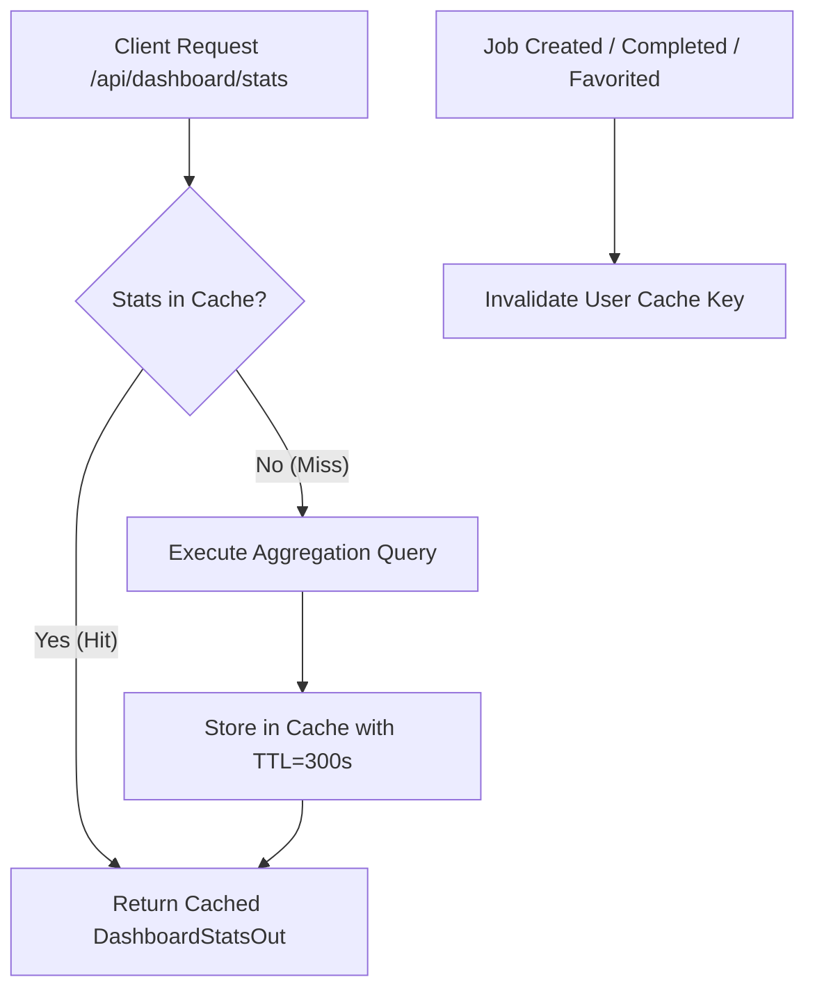

# Pre-Implementation Review: Search, Sorting, Date Filtering & Stats Caching Architecture

**Author:** Senior Backend Systems Engineer  
**Status:** Under Review / Proposed Architecture  
**Target:** Diva API (`apps/api`)

---

## 1. Executive Summary

As the platform scales to 10,000+ users and millions of generation jobs, database bottlenecks emerge around two key operations:
1. **Unindexed aggregate count queries** (`COUNT(*)` on `generation_jobs` and `users`) executed repeatedly on dashboard page loads.
2. **Flexible querying capabilities** needed by power users: finding generations by keyword, finding the fastest or cheapest model runs, and filtering by date ranges (e.g. "jobs from last week").

This specification outlines the technical design to address these challenges with high throughput, low latency (< 15ms query execution), and clean modular architecture.

---

## 2. Technical Architecture & Database Design

### 2.1 Compound Indexes (`generation_jobs` Table)
To support sorting and filtering without triggering full table scans:

```python
__table_args__ = (
    Index("idx_jobs_user_created", "user_id", "created_at"),
    Index("idx_jobs_user_latency", "user_id", "latency_ms"),
    Index("idx_jobs_user_cost", "user_id", "cost_usd"),
    Index("idx_jobs_user_status", "user_id", "status"),
)
```

- **`idx_jobs_user_created`**: Accelerates default ordering (`created_at DESC`) and date range queries (`created_at >= start_date AND created_at <= end_date`).
- **`idx_jobs_user_latency`**: Accelerates latency-based sorting (`ORDER BY latency_ms ASC NULLS LAST`).
- **`idx_jobs_user_cost`**: Accelerates cost-based sorting (`ORDER BY cost_usd ASC NULLS LAST`).

---

### 2.2 Stats Caching Strategy (`DashboardStatsCache`)

Running `COUNT(*)` across large tables per user request degrades database IOPS. We introduce an event-driven TTL stats caching service (`app/services/stats_cache.py`):



- **Cache Lifetime (TTL)**: 300 seconds (5 minutes).
- **Cache Invalidation**: Triggers immediately when:
  1. A new job is submitted (`create_job`).
  2. A job transitions to `COMPLETE` or `FAILED` (`job_runner`).
  3. A user toggles a job favorite status (`toggle_favorite`).
  4. A job is deleted (`delete_job`).

---

### 2.3 Search Engine Specification

Substring and multi-column search parameter `q` (e.g. `q="headshot"`, `q="professional"`):
- Filters against `GenerationJob.prompt_used`
- Filters against `ReferencePhoto.title`
- Filters against `ReferencePhoto.collection`

**SQL Equivalent:**
```sql
WHERE generation_jobs.user_id = :user_id
  AND (
    generation_jobs.prompt_used ILIKE '%headshot%'
    OR reference_photos.title ILIKE '%headshot%'
    OR reference_photos.collection ILIKE '%headshot%'
  )
```

---

### 2.4 Date Range Filtering Specification

Supported query parameters:
- `start_date` (ISO 8601 string, e.g. `2026-07-01T00:00:00Z`)
- `end_date` (ISO 8601 string, e.g. `2026-07-15T23:59:59Z`)
- `date_preset` (Convenience enum string):
  - `today`: Start of current UTC day
  - `last_7_days`: Current time minus 7 days
  - `last_30_days`: Current time minus 30 days
  - `last_week`: Full preceding calendar week (Monday to Sunday)

---

### 2.5 Multi-Criteria Sorting Specification

Supported query parameters:
- `sort_by`:
  - `created_at` (default): Sort by creation timestamp
  - `latency`: Sort by generation execution time in milliseconds (`latency_ms`)
  - `cost`: Sort by generation cost in USD (`cost_usd`)
- `order`:
  - `desc` (default for `created_at`, highest cost/latency first)
  - `asc` (default for `latency`/`cost` when finding fastest/cheapest)

---

## 3. Updated API Contract Summary

### `GET /api/jobs` and `GET /api/dashboard/history`

```http
GET /api/jobs?q=headshot&sort_by=latency&order=asc&date_preset=last_7_days&page=1&per_page=12 HTTP/1.1
Authorization: Bearer <token>
```

#### Query Parameters
| Parameter | Type | Default | Description |
| :--- | :--- | :--- | :--- |
| `q` | `str` | `None` | Case-insensitive search keyword for prompts & title |
| `sort_by` | `str` | `"created_at"` | Field to sort by: `created_at`, `latency`, `cost` |
| `order` | `str` | `"desc"` | Sort direction: `asc` or `desc` |
| `date_preset` | `str` | `None` | Range preset: `today`, `last_7_days`, `last_30_days`, `last_week` |
| `start_date` | `datetime` | `None` | Explicit range start filter |
| `end_date` | `datetime` | `None` | Explicit range end filter |
| `status` | `str` | `None` | Job status filter (`complete`, `pending`, `failed`) |

#### Response (`JobHistoryOut`)
```json
{
  "items": [
    {
      "id": "job-uuid",
      "status": "complete",
      "reference_title": "Professional Headshot",
      "reference_thumbnail": "/storage/thumbnails/headshot.jpg",
      "selfie_image_url": "/storage/selfies/user.jpg",
      "result_urls": ["/storage/results/job-uuid-1.jpg"],
      "is_favorite": true,
      "latency_ms": 1420,
      "cost_usd": 0.0035,
      "created_at": "2026-07-15T14:30:00Z",
      "error": null
    }
  ],
  "total": 1,
  "page": 1,
  "per_page": 12,
  "pages": 1
}
```
